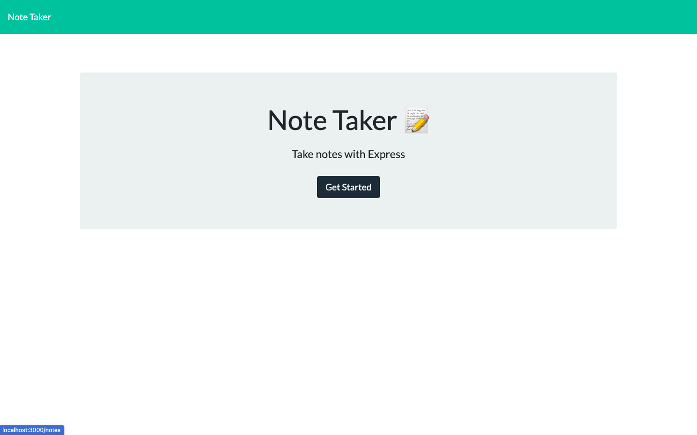
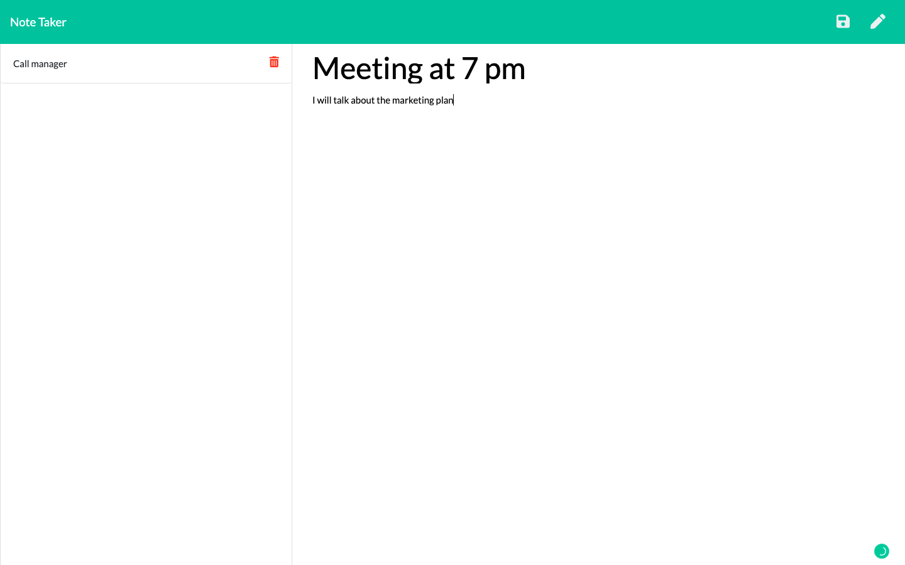

  ## Description
  This tool allows users to create "to do items" add them to their list. Items added to the list can be brought back for review and/or deleted when they are completed 

  https://github.com/Noreldin-S/Note-Taker

  ## Table of Contents
  
  * [Installation](#installation)
  * [Usage](#usage)
  * [Contributing](#contributing)
  * [Questions](#questions)

  ## Installation
  To install necessary dependencies, run the following command:
  `
  npm install
  `

  ## Usage
  Enter text and press the save icon to add it to the list. You can click on the title of any item in the list to bring it back up to view the details.  
  To write a new note click the pencil icon in the top right corner of the page.  
  To delete any item from the saved list, click the corresponding trash can icon next to the list item.  
  
  
  <b />
  

  ## Contributing
  [Submit any issues](https://github.com/Noreldin-S/Note-Taker/issues)

  ## Questions
  If you have any questions about the repo, contact [Noreldin Saad](https://github.com/Noreldin-S) or directly at [s.noreldin@hotmail.com]
